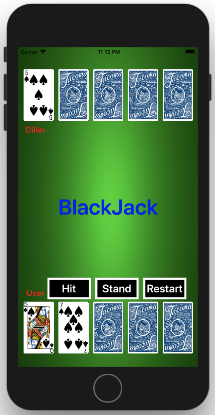
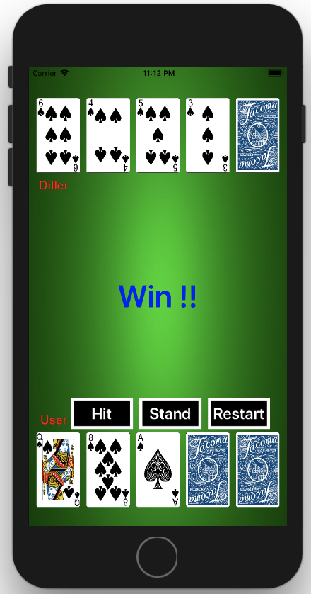
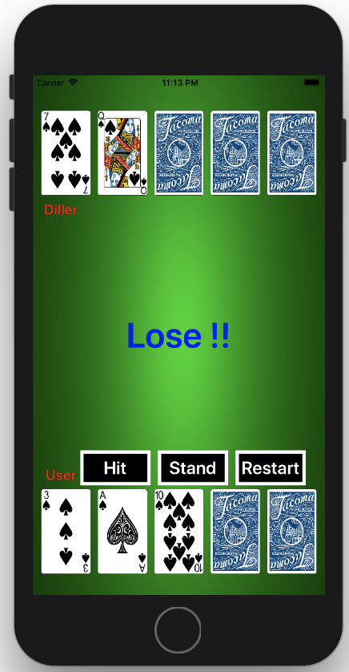
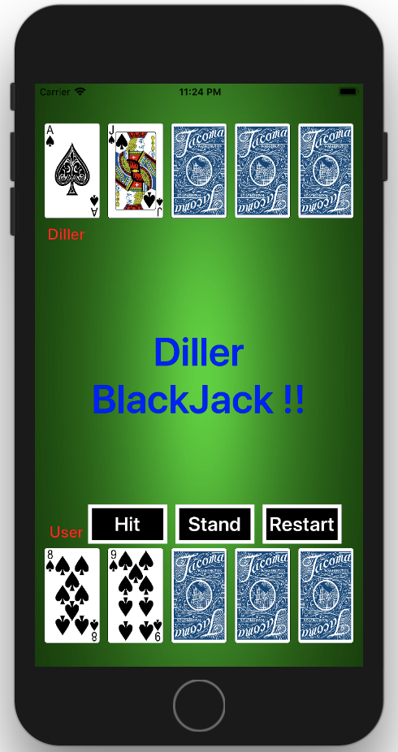

# BlackJack

## 1. 규칙
1. 먼저 딜러를 정한 뒤, 베팅을 한다.
2. 딜러가 자신을 포함한 참가자 전원에게 카드 두 장을 나누어주는데, 딜러의 카드 한 장은 상대에게 보이지 않는다.
3. 카드의 합이 딜러보다 먼저 21이 되거나 딜러보다 21에 가깝게 되면 이기고, 카드를 더 받았는데 21을 초과하면 버스트(Bust)된다.
4. 먼저 받은 카드 두 장의 합이 21에 못 미치면 히트(Hit)라고 말한 뒤 한 장씩 더 받을 수 있고, 멈추려면 스탠드(Stand)라고 말한다.
5. 딜러는 카드의 합이 16 이하면 무조건 한 장을 더 받아야 하고, 17 이상의 경우에는 멈추어야 한다.
6. 딜러의 카드와 합이 같으면 비긴 것이 된다.
7. 에이스 카드는 1이나 11로 취급할 수 있고, 10, J, Q, K는 모두 10으로 계산한다.
8. 처음 받은 카드 두 장이 에이스와 10, J, Q, K 중의 하나로 합이 21이 되면 블랙잭(Blackjack)이 되고, 베팅한 금액의 1.5배의 돈을 받는다.

## 2. 게임화면
[시작화면] 
[승리화면]  
[패배화면] 
[딜러블랙잭] 

## 3. 코드
ViewController를 제외하고 4개의 클래스를 생성하였습니다.

- [BackImg](https://github.com/wargi/SangWookPark_IOS_School6/blob/master/Study/BlackJack/BlackJack/BackView.swift)
- [Card](https://github.com/wargi/SangWookPark_IOS_School6/blob/master/Study/BlackJack/BlackJack/Card.swift)
- [DisplayButton](https://github.com/wargi/SangWookPark_IOS_School6/blob/master/Study/BlackJack/BlackJack/DisplayButton.swift)
- [DisplayStatus](https://github.com/wargi/SangWookPark_IOS_School6/blob/master/Study/BlackJack/BlackJack/StateLB.swift)
- [ViewController](https://github.com/wargi/SangWookPark_IOS_School6/blob/master/Study/BlackJack/BlackJack/ViewController.swift)