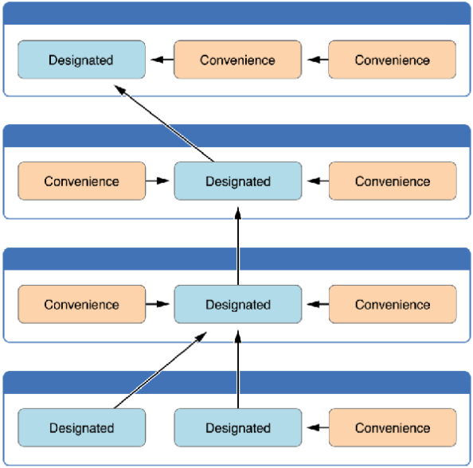

# 2018.01.23
## 1. 기본 Init
- 초기화는 클래스, 구조체, 열거형의 인스턴스를 만들기 위한 준비 과정으로 사용됩니다.
- 인스턴스에 설정된 속성의 초기값을 설정과 초기화하는데 목적이 있다.
- 클래스 및 구조체는 인스턴스로 만들어 질때 모든 프로퍼티는 적절한 초기값으로 모두 초기화 해야 한다.
- 구조체는 자동으로 Memberwise Initializers가 만들어 진다.

~~~swift
//Base Initializers
struct Subject {
	var name:String
}
class Student {
	var subjects:[Subject] = []
	func addSubject(name:String) {
	//Memberwise Initalizers
	let subject = Subject(name: name)
	subjects.append(subject)
	}
}

//= var wingMan:Person = Person.init() 동일
var wingMan:Person = Person()

//Memberwise Initializers
struct Subject {
	var name:String
	
	init(name: String) {
	/* 
	memberwise Initializer
	self.name = name
	개발자가 초기화 메서드를 정의하지 않으면 구조체는 자동으로 모든 
	프로퍼티를 대응하는 초기화 메서드를 제공한다.
	*/
	}
}

//Memberwise Initializers
let subject = Subject(name: name)
= let subject = Subject.init(name: name)
~~~

## 2. 상속과 Init
- 부모 클래스로부터 상속받은 모든 저장 속성은 초기화할 때 초기 값을 할당받아야 함.
- Swift는 클래스 타입에 모든 저장 속성에 초기 값을 받도록 도와 주는 두가지 이니셜라이저를 정의함. 이를 지정 이니셜라이저 (designated initializers)와 편의 이니셜라이저(convenience initializers)라고 함.

~~~swift
	
class SomeClass {
	//Designated initializers
	//모든 프로퍼티가 초기화 되어야 한다.
	//상속을 받았다면 부모 클래스의 Designated initializers를  
	//호출 해야 한다.
	init(parameters) { 
		//statements
	} 

	//Convenience initializers
	//다른 convenience initializer을 호출할수 있다.
	//하지만 궁극적으론 designated initializer을 호출해야만 한다.
	convenience init(parameters) {
		//statements 
	}

	//Required Initializers
	//해당 initializer는 필수적으로 구현해야만 한다.
	//상속받은 모든 클래스는 필수로 구현해야 한다.
	//required initializer를 구현할땐 override 수식어를
	//사용할 필요 없다.
	required init() {
		// initializer implementation goes here
	}
	
	//클래스의 종료직전에 사용
	deinit {
		//종료직전 필요한 내용 구현
	}
}
~~~

## 3. Class의 상속
- Subclassing
- 기존에 구현되어있는 클래스를 확장, 변형
- 부모 클래스(super class, parent class)와 자식 클래스(sub class, child class)로 관계를 표현
- 상속 할 수록 더 확장되는 구조 
>> 즉, 자식이 기능이 더 많다.
- Swift에선 단 하나의 클래스만 상속 받을수 있다.
- Struct, enum은 상속 받을수 없다.
- 클래스 이름뒤에 (: 부모클래스) 를 추가 한다.
- 프로토콜과 문법이 같다.

## 4. Class의 재정의(Override)
- 부모 클래스에게서 물려받은 성질을 그대로 사용하지 않고  자식 클래스에게 맞는 형태 또는 행위로 변경하여  
사용할 수 있는 기능

~~~swift
/*
Person 클래스의 eat 메서드는 집밥을 먹도록 하고, 
Person 클래스를 상속받은 Student 클래스의 eat 메서드는  급식을 먹게 하고, 
Student 클래스를 상속받은 UniversityStudent 클래스의 eat 메서드는 학식을 먹게 만들어 봅시다
*/

class Person {
	func eat() {
	print("집밥")
	}
}

class Student: Person {
	override func eat() {
	print("집밥")
	}
}
~~~