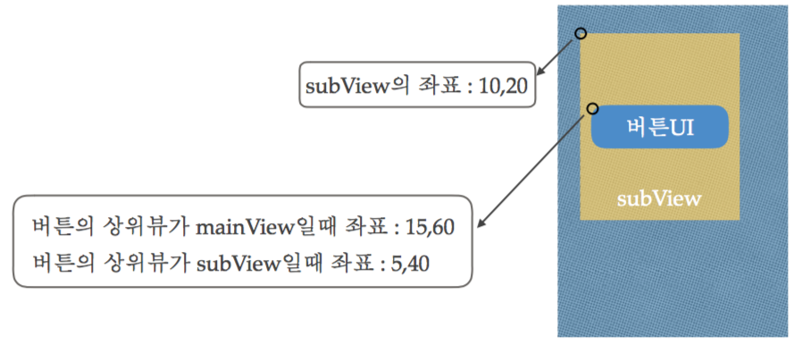

# 2018.01.29

## 1. 좌표계 Frame-Base
  
<right> View의 위치는 상대적으로 상위뷰를 기준으로 위치를 잡는다 

## 2. FrameWork
- 애플리케이션 프레임워크(Application Framework)는 프로그래 밍에서 특정 운영 체제를 위한 응용 프로그램 표준 구조를 구현 하는 클래스와 라이브러리 모임이다. 간단하게 프레임워크라고 부른다.
- 재사용할 수 있는 수많은 코드를 프레임워크로 통합함으로써 개 발자가 새로운 애플리케이션을 위한 표준 코드를 다시 작성하지 않아도 같이 사용된다.
- 프레임워크의 구현은 객체 지향 프로그래밍 기법이 사용되고 있 는 응용 프로그램 고유의 클래스가 프레임워크의 기존 클래스를 상속할 수 있다.