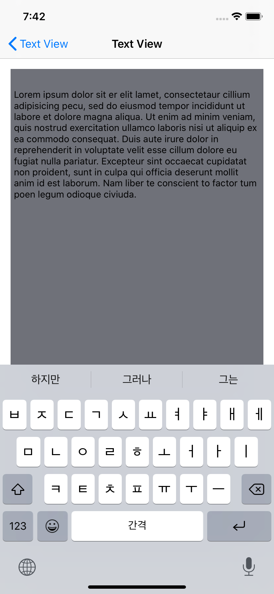

# Text View

## 1. 텍스트뷰 란?
- 텍스트 필드에 스크롤을 추가해서 사용자가 더 넓은 범위에 입력을 도와주는 UI

## 2. 기능
~~~swift
@IBOutlet weak var textView: UITextView!

// 텍스트 뷰 내부에 인셋 추가
// 인셋을 추가해주면 지정한 인셋까지의 여백이 생기고 그 이후에 글자가 입력된다.
// ** [별첨1 - 이미지 확인] **
textView.textContainerInset = UIEdgeInsets(top: 30, left: 0, bottom: 30, right: 0)
textView.scrollIndicatorInsets = textView.textContainerInset
    
// attachment 이용하여 textView 상단에 image 표시
// textView는 textKit을 통해 text를 출력하는데 내부에 텍스트 컨테이너가 있고 여기에 이미지를 추가할 수 있는데
// attachment 이용하여 이미지를 첨부할 수 있다.
// ** [별첨2 - 이미지 확인] **
let logo = UIImage(named: "logo") // 첨부할 이미지

let attachment = NSTextAttachment() // attachment 생성
attachment.image = logo // attachment에 이미지 첨부

// 텍스트 스토리지를 통해 내부 저장소에 접근하여 insert(at:) 메서드를 이용하여 이미지를 저장해준다.
textView.textStorage.insert(NSAttributedString(attachment: attachment), at: 0)
    
// 텍스트 뷰에서 특정 범위를 선택 하였을 때 호출하는 델리게이트
extension TextSelectionViewController: UITextViewDelegate {
   func textViewDidChangeSelection(_ textView: UITextView) {
      let range = textView.selectedRange
      
      print(range) // 선택한 범위 출력
   }
}

// Data Detection
// : 전화번호, 랑크, 주소 등 입력한 주소의 자도를 보여주거나 입력한 홈패아자의 링크로 바로 넘어갈 수 있게 해주는 기능
// : 사용할려면 텍스트뷰의 속성의 Behavior 속성이 해제 되있어야하며 자신이 이용할 데이타 디텍션을 선택해야한다.
// : ex) Link, Address, Phone Number ...
// ** [별첨3 - 이미지 확인] **

// 코드로 Data Detection 구현하기
textView.dataDetectorTypes = [.link, .address, .phoneNumber]
~~~

## 3. 별첨
1. 
2. 
3. 