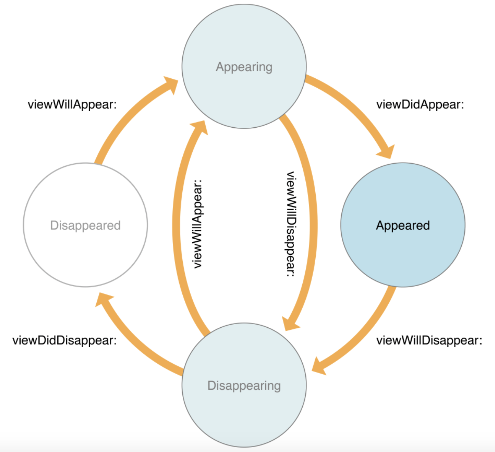

# 2018.02.26

## 1. Application Life Cycle
- 블로그의 내용이 개인적으로 이해가 잘 되어 참고하여 작성하였습니다.
- 앱 생명주기는 홈버튼을 눌렀을때, 전화가 왔을때와 같이 앱이 화면상에서 보이지 않는 background 상태, 화면에 올라와 있는 상태인 foreground 등과 같은 상태들을 정의한 것 입니다.
- 제대로 된 앱을 만들기 위해서는 다양한 상황에서도 적절하게 대응해야 하기 때문에 앱 생명주기를 이해하는 것은 중요합니다.

### 1-1. Application Execution
1. UIApplication 객체를 생성
2. @UIApplicationMain 어노테이션이 있는 클래스를 찾아 AppDelegate 객체를 생성
3. Main Event Loop를 실행(touch, text input등 유저의 액션을 받는 루프) 및 기타 설정

### 1-2. UIApplication
UIApplication 객체는 싱글톤 객체(앱 전체에 하나만 존재)이며 Event Loop에서 발생하는 여러 이벤트들을 감지하고 Delegate에 전달하는 역할을 합니다.

> 예시) 어플리케이션이 백그라운드로 갈때나 메모리 부족 경고를 할 때와 같은 상황들을 감지하여 Delegate에 전달하는 역할 

### 1-3. AppDelegate
1. Xcode로 Swift 프로젝트를 만들면 AppDelegate.swift 파일을 자동으로 생성
2. AppDelegate.swift 파일에는 앱의 상태에 따라 실행되는 함수들이 정의.
3. AppDelegate.swift 파일을 열어보면 클래스 선언부에 @UIApplicationMain 어노테이션이 붙어 있는걸 볼 수 있습니다.
4. 앱이 구동되면 AppDelegate.swift의 AppDelegate 클래스를 델리게이트 객체로 지정
5. AppDelegate.swift 파일이 AppDelegate 객체가 된다.
6. 정의된 함수들을 보기에 앞서 앱의 실행 상태는 5개 상태로 구분 될 수 있고 아래와 같습니다.

~~~
<앱의 실행 상태 5가지>
Not Running: 앱이 실행되지 않은 상태
(Inactive와 Active 상태를 합쳐서 Foreground 라고 함)
Inactive: 앱이 실행중인 상태 그러나 아무런 이벤트를 받지 않는 상태
Active: 앱이 실행중이며 이벤트가 발생한 상태
Background: 앱이 백그라운드에 있는 상태 그러나 실행되는 코드가 있는 상태
Suspened: 앱이 백그라운드에 있고 실행되는 코드가 없는 상태
~~~

### 1-4 AppDelegate Method
~~~swift
//앱이 처음 시작될 때 실행
application(_:didFinishLaunching:)

//앱이 active 에서 inactive로 이동될 때 실행 
applicationWillResignActive:

//앱이 background 상태일 때 실행
applicationDidEnterBackground: 

//앱이 background에서 foreground로 이동 될때 실행
//(아직 foreground에서 실행중이진 않음)
applicationWillEnterForeground: 

//앱이 active상태가 되어 실행 중일 때
applicationDidBecomeActive:

//앱이 종료될 때 실행
applicationWillTerminate:

/*
위의 함수를 모두 구현 할 필요는 없고 
상황에 맞춰 필요한 함수만 구현하여도 됩니다. 
혹은 위 함수들에는 없지만 원하는 delegate를
추가할 수 도 있습니다.
*/
~~~

## 2. ViewController LifeCycle

### 2-1. ViewController LifeCycle 중요성
모바일 앱은 화면의 크기가 작아서 PC와 달리 하나의 화면에 하나의 ViewController만을 가집니다. 그리고 여러 개의 ViewController가 모여 하나의 앱을 만듭니다. IOS 에서는 한 화면에서 다른 화면으로 전환할 때 기존의 화면위에 새로운 화면이 쌓이는 식으로 화면을 전환 합니다. 이 때 각각의 뷰 컨트롤러는 자신만의 생명주기를 가지고 있고 이 생명주기를 잘 이해하고 있어야 뷰 컨트롤러의 상황에 따라 원하는 로직을 수행하도록 만들 수 있습니다.

### 2-2. ViewController LifeCycle?
- ViewController의 생명주기를 나타낸 그림

여러개의 뷰 컨트롤러가 있는 앱이라고 한다면 각각의 뷰 컨트롤러는 자신만의 생명주기를 가집니다. 그래서 화면상에 등장 할 때, 사라질 때 등 상황에 맞춰서 함수들이 호출됩니다. 뷰 컨트롤러 생명주기의 대표적인 함수들은 아래와 같습니다.

- ViewDidLoad: 해당 뷰컨트롤러 클래스가 생성될 때(ViewWillAppear전에 실행) 실행됩니다. Low memory와같은 특별한 경우가 아니라면 딱 한번만 실행되기 때문에 초기화 할 때 사용 할 수 있습니다.
- ViewWillAppear: 뷰 컨트롤러가 화면에 나타나기 직전에 실행됩니다. 뷰 컨트롤러가 나타나기 직전에 항상 실행되기 때문에 해당 뷰 컨트롤러가 나타나기 직전마다 일어나는 작업들을 여기에 배치 시킬 수 있습니다.
- ViewDidAppear: 뷰 컨트롤러가 화면에 나타난 직후에 실행됩니다. 화면에 적용될 애니메이션을 그리거나 API로 부터 정보를 받아와 화면을 업데이트 할 때 이곳에 로직을 위치시키면 좋습니다. 왜냐하면 지나치게 빨리 애니메이션을 그리거나 API에서 정보를 받아와 뷰 컨트롤러를 업데이트 할 경우 화면에 반영되지 않습니다.
- ViewWill/DidDisappear: 뷰 컨트롤러가 화면에 나타난 직전/직후에 실행됩니다.

