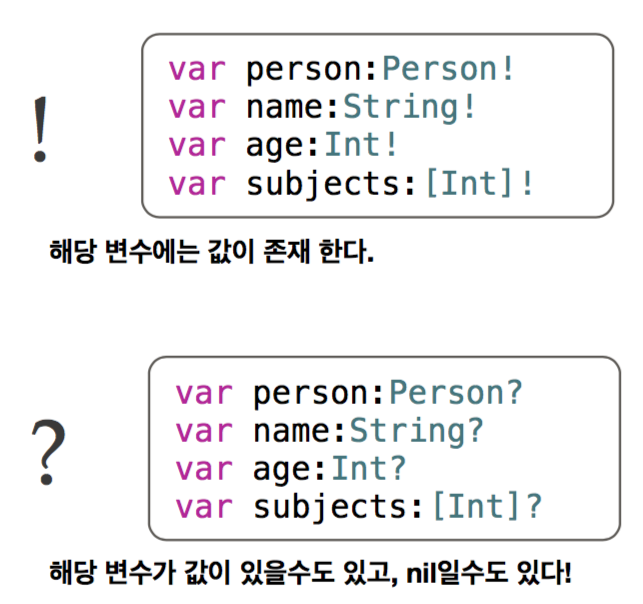

# 2018.01.25
## 1. 옵셔널이란?
- nil인 상태에서 속성을 참조하거나, 함수를 실행시 발생하는 error로 인한 코드의 불안정성 내포
- Swift의 중요한 특징 중 하나는 Safety!! •Type Safety를 위해 컴파일러 수준의 nil 체크
- 만약 nil인 변수 선언을 해야할 경우 optional을 사용한다.
- optional은 두가지 가능성을 가질수 있는데 한개는 값이 있음을(!기호) 나타내고 또다른 한가지는 nil일 가능성을 내포하고 있다.(?기호)

## 2. 옵셔널 선언

## 3. 옵셔널 바인딩 방법

~~~swift
//1. 옵셔널 강제해제
func testFuc(optionalStr:String?)
{
	if optionalStr != nil
	{
		let unwrapStr:String = optionalStr!
		print(unwrapStr)
	}
}

//2. 옵셔널 선택적 해제
func isNumber(inputNum1:String, inputNum2:String) -> Bool
{
//(,) 콤마를 통해 옵셔널 바인딩을 추가하고, 또 조건도 추가 할수 있다.
	if let firstNumber = Int(inputNum1), let secondNumber = Int(inputNum1)
	{
		return true
	} else
	{
		return false
	}
}

//3. Early Exit
func testFuc(optionalStr:String)
{
	guard let unwrapStr:String = optionalStr else
	{
		//조건값이 거짓일때 실행
		//종료 조건이 항상 필요
		return
	}
	print(unwrapStr)
}
~~~