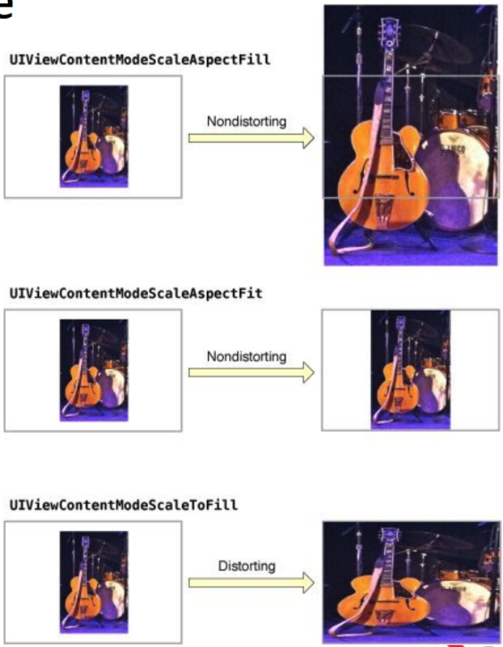
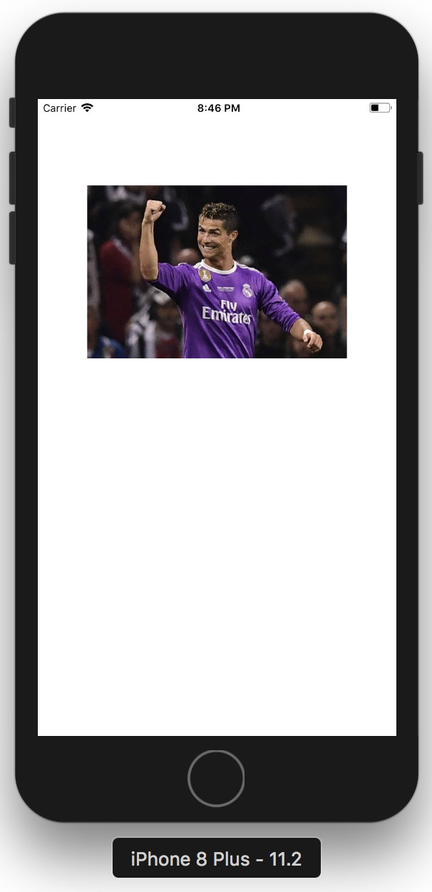

# 2018.01.31

## 1. UIImageView
- 인터페이스에 단일 이미지 또는 애니메이션 이미지 시퀀스를 표시해주는 뷰.

## 2. UIImageView Content Mode

## 3. UIImageView 예제

~~~swift
//실습코드
//이미지뷰 생성 및 프레임 설정
let newImgV = UIImageView(frame: 
CGRect(x: view.bounds.width / 2 - 150, y: 100, width: 300, height: 200))

//Add Image File
//단일 이미지 리소스 추가
//Assets.xcassets에 추가
//ho.JPG 이미지 추가
newImgV.image = UIImage(named:"ho.JPG")

//contentMode 설정
newImgV.contentMode = UIViewContentMode.scaleAspectFit

//root view에 newImgV를 올린다.
self.view.addSubview(newImgV)
~~~