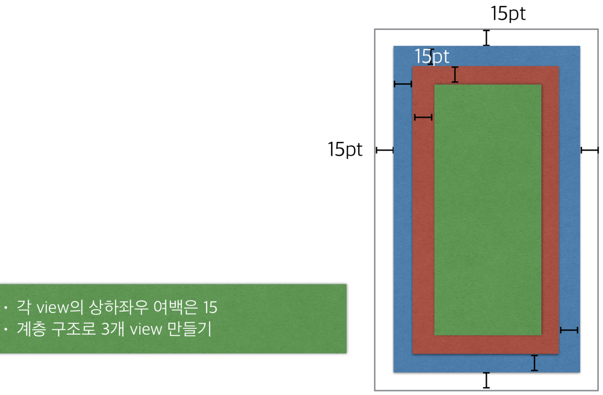
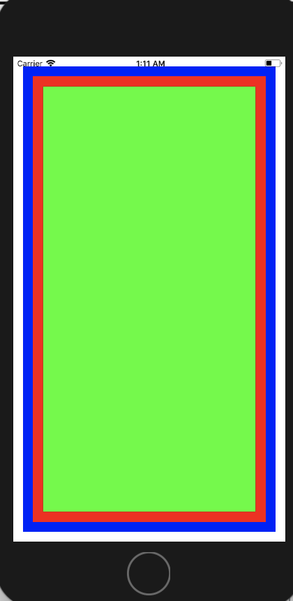

# 2018.01.29

## 1. UIView
- 가장 기본이 되는 View
- UIComponent들의 조합으로 화면이 구성되며 UIView를 상속받았다. 즉 iOS 화면구성은 UIView의 집합으로 되어 있다.

## 2. UIView Class
~~~swift
//뷰를 초기할 때 뷰의 크기 설정
public init(frame: CGRect)

//뷰의 태그 값 부여
open var tag: Int

//뷰의 크기설정
//프레임과 바운즈의 차이
//: 상위뷰의 frame과 관계없을 때 바운즈, 있을 때는 프레임
open var frame: CGRect
open var bounds: CGRect

//뷰가 한 번에 두 개 이상의 터치를 수신하는지 여부
open var isMultipleTouchEnabled: Bool

//하위 뷰를 뷰의 경계로 제한할지 여부
open var clipsToBounds: Bool

//뷰의 배경색
open var backgroundColor: UIColor?

//뷰를 숨길지의 여부
open var isHidden: Bool

//매번 뷰의 내용을 다시 그린다.
//대신 이 속성을 사용하면 내용의 크기를 조절(왜곡 여부를 지정)
//뷰를 특정 지점에 고정시킬 수 있다.
open var contentMode: UIViewContentMode

//어떤뷰위에 자신의 뷰를 올릴때 사용하는 함수
open func addSubview(_ view: UIView)

//올려져있는 뷰들 사이에 넣을 때 사용하는 함수
open func insertSubview(_ view: UIView, at index: Int)

//서브뷰를 지울 때 사용하는 함수
open func removeFromSuperview()
~~~

## 3. UIView 실습

## 4. 실습 결과
- 실습 결과 화면 
 
 
- [실습코드 보기](https://github.com/wargi/SangWookPark_IOS_School6/blob/master/Practice/UIViewSample/UIViewSample/ViewController.swift)  