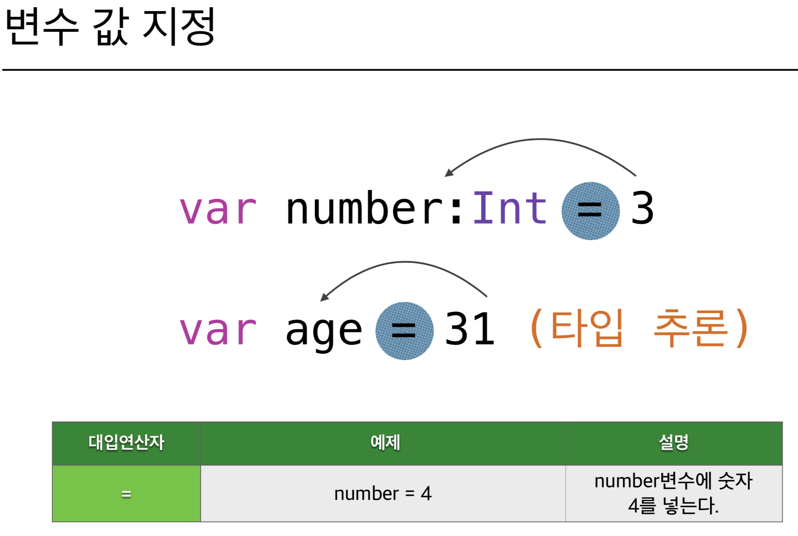

# 2018.01.15 #

## 1. 변수 / 상수 ##
- 변수 : 프로그램 상에 데이터를 저장하고 이름을 부여하며 변할 수 있는 값
- 상수 : 프로그램 상에 데이터를 저장하고 이름을 부여하지만 변경 할 수 없는 값

## 2. 변수 / 함수 선언 ##
- 변수 / 상수 선언 
> 키워드 + 변수 명(Name) + 변수 타입(Type) 
> 선언 동시에 값을 넣어 주어도 상관 없다. 
- 함수 선언 
> 키워드 + 함수명(Name) + 입력값(Input Value) + 함수 내용(Action) + 결과타입(Return Type) 

~~~
// 변수 선언
var vName : Any

// 상수 선언
let lName : Any

//선언 동시에 값 부여
var vName : Int = 1

// 함수 선언
func vName(_ parameter: Any) -> Any 
{ 
	//함수 내용 
}

//타입에 선언 된 Any는 스위프트 내의 모든 타입을 나타냄
~~~

## 3. 변수명 규칙 ##
- 변수 안에 들어갈 데이터를 표현하는 이름으로 작성 
- 중복 작성 불가 (한 클래스, 함수, 구문) 
- 시스템 예약어와 공백, 숫자로 시작하는 것은 불가하다 
- 변수&함수는 lowerCamelCase 
- 클래스명은 UpperCamelCase로 작성 하는게 좋다 
> 필수는 아니지만 다른 사람과 협업을 위해서 작성해주는게 좋다

## 4. 변수 타입 ##
>- 정수형 : Int 
>
>~~~
>var intName:Int
>~~~
>
>- 실수형 : Double 
>
>~~~
>var doubleName:Double
>~~~
>
>- 문자형 : String 
>
>~~~
>var stringName:String
>~~~
>- 논리형 : Bool 
>
>~~~
>var boolName:Bool
>~~~
>
>- 참조형 : ClassName
>
>~~~
>var customView:UIView
>var timer:Timer
>~~~

## 5. 변수 값 지정 ##

## 6. 다양한 형태의 변수 선언 ##
~~~
//일반 변수 선언
var name:String = “joo”

//변수 값 재정의
var number:Int = 50 number = 100

//상수 선언
let PI = 3.14

//옵셔널 변수 선언
var address:String?
address = “서울시 신사동”
~~~

## 7. 형변환(TypeCasting)
- 다른 형태의 타입을 가진 변수를 계산할려고 할때 같은 타입으로 임시적으로 바꾸어주어 계산을 가능하게 해준다. 
- 스위프트에서는 묵시적 형변환은 안되며 명시적 형변환을 해주어야 한다. 