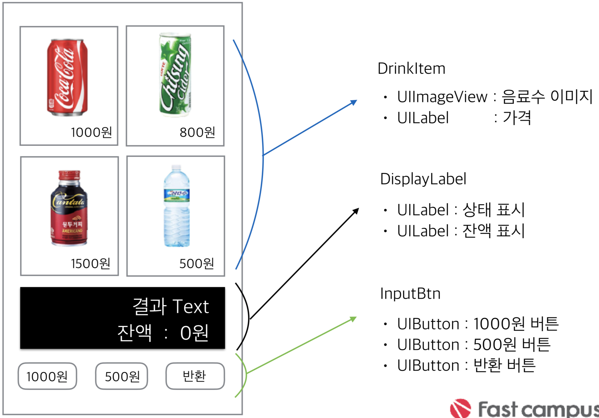
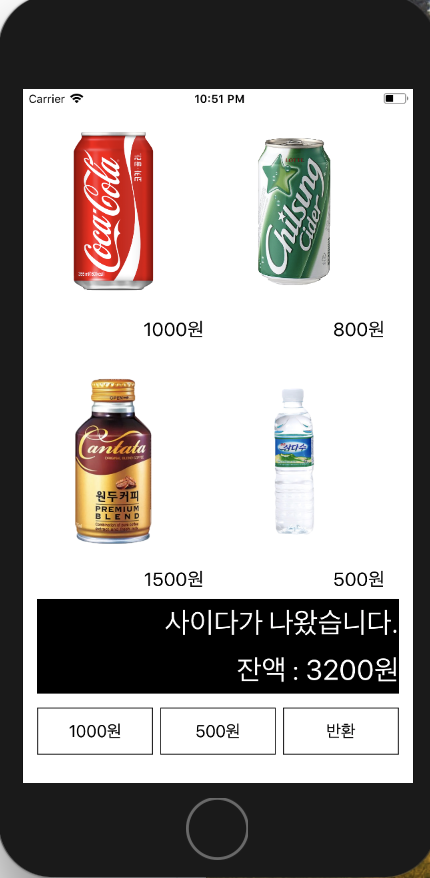

# 자판기 만들기

## 1. 화면 구성

## 2. 자판기 기능
> 500원 버튼 클릭시 
>- “500원이 입금 되었습니다.” 
>- 잔액 : 500원 
> 
> 500원 버튼 클릭시 
>- “500원이 입금 되었습니다.” 
>- 잔액 : 1000원 
> 
> 사이다 아이템 클릭시 
>- “사이다가 나왔습니다.” 
>- 잔액 :200원 
> 
> 반환 버튼 클릭시  
>- “200원이 반환 되었습니다.” 
>- 잔액 : 0원

## 3. 구현
- 구현 이미지 

- ViewController부분을 제외하고 3개의 부분으로 나누어 클래스를 생성하였다

> <코드>
> 
>- [화면에 보이는 음료수의 이미지로 구성된 버튼부분](https://github.com/wargi/SangWookPark_IOS_School6/blob/master/Practice/UIExam/UIExam/DrinkItem.swift)
>
>- [화면에 보이는 결과 레이블 부분](https://github.com/wargi/SangWookPark_IOS_School6/blob/master/Practice/UIExam/UIExam/ResultLB.swift)
>
>- [돈을 입력하는 버튼 부분](https://github.com/wargi/SangWookPark_IOS_School6/blob/master/Practice/UIExam/UIExam/DisplayBtn.swift)
>
>- [ViewController](https://github.com/wargi/SangWookPark_IOS_School6/blob/master/Practice/UIExam/UIExam/ViewController.swift)